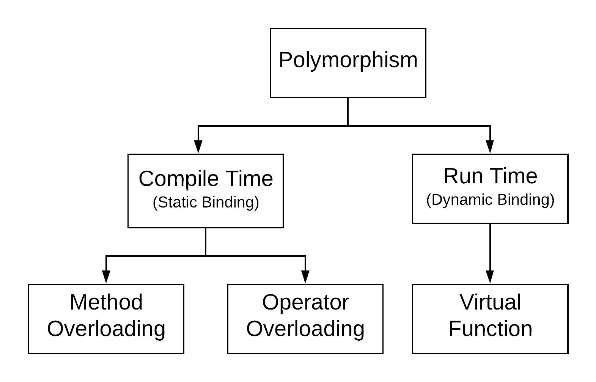

# C++ Note

## Index
* [Class](#class)
  * [Constructor](#constructor)
* [Polymorphism](#polymorphism)
* [Container](#container)
  * [priority_queue](#priority_queue)
  * [map](#map)
  * [tuple](#tuple)
  * [array](#array)
* [Memory](#memory)
  * [Memory Type and Object Life Cycle](#memory-type-and-object-life-cycle)
  * [Dynamic Memory and Smart Pointer](#dynamic-memory-and-smart-pointer)
* [Snippet](#snippet)
  * [String casting](#string-casting)
  * [Randomization](#randomization)
  * [Overload << for a class](#overload--for-a-class)
* [Other](#other)
  * [complex](#complex)
  * [final specifier](#final-specifier)
  * [Macro max and min value](#macro-max-and-min-value)
* [Memo](#memo)

*** 

## Class
### Constructor
```cpp
class Test {
 private:
  int a;
  int& ref_a;
 public:
  Test(int num);
};
// version 1
Test::Test(int num) {
  a = num;
  ref_a = num; // error will occur here
}
// version 2
Test:Test(int num): a(num), ref_a(num) {}
```
In the version 1, inside the constructor's function body, the constructor just assign the values to the class members. The class members are explicitly initialized by the default constructor before the constructor's function body. However, for the reference type, it does not have a default constructor, so it has to be explicitly initialized. This is the reason of the error. </br>
</br>
In the version 2, the class members are explicitly initialized in the constructor initializer list, so there is no error. In the initializer list, the order of the initialization only depends on the order of the appearance of each class member in the class. </br>
</br>
Tips: develop a habit of using the constructor initializer list! It will avoid mistakes.

***

## Polymorphism
Polymorphism means "many forms" derived from a Greek word. This is one of the key ideas of the Object Oriented Programming(OOP). </br>
### Polymorphism Structure </br>


***

## Container
### priority_queue
header file: `<queue>` <br>
class template: `template <class T, class Container = vector<T>, class Compare = less<typename Container::value_type> > class priority_queue;` </br> </br>
The type `T` should be comparable. <br>
* `priority_queue<int> pq` <br>
  In this situation, `pq` is a `max heap`. That is to say that the top element of `pq` is always the biggest element. </br>
  Why? According to the class template above, we know that `less<T>` is the default comparator. When it does the down-heap operation, we swap the current element with its smaller child(if exists) when the current element is `less` than its smaller child.
* `priority_queue<int, vector<int>, greater<int>> pq` <br>
  In this situation, we use the `greater<T>` as the comparator, so now `pq` is a `min heap`.
* A priority queue with a customized class
    ```cpp
    class Edge {
      int u, v, w;
      
      Edge() = default;
      Edge(int _u, int _v, int _w) : u(_u), v(_v), w(_w) {}

      inline bool operator<(const Edge& other) const {
        return w < other.w;
      }
    };

    priority_queue<Edge> pq;
    ```
    If we want to create a priority queue with a customized class. The class needs to override the `<` operator. <br>
    In this example, the top element of `pq` is an `Edge` object with the max `w` value. If you change `w < other.w` to `w > other.w`, then the top element of `pq` is an `Edge` object with the min `w` value.
### map
header file: `<map>` </br>
class template: `template<class Key, class T, class Compare = less<Key>, class Alloc = allocator<pair<const Key,T>>> class map;` </br> </br>
I often use the map to store the original indexes before sorting an array. However, when the elements in an array **may have the same value**, please **DON'T USE THIS**, since it will bring bugs which are really hard to find. In this case, just consider using `pair<...>`, `<tuple>` or `array`.
### tuple
header file: `<tuple>` `C++11`</br>
class template: `template <class... Types> class tuple;` </br> </br>
A tuple can have many elements with different types.
* Create a tuple
  ```cpp
  tuple<int, char> foo(10, 'x');
  tuple<int, char> bar = make_tuple(10, 'x');
  ```
* Access and modify elements in a tuple
  ```cpp
  #include <tuple>
  #include <iostream>

  using namespace std;

  int main() {
    tuple<int, char> foo(10, 'x');
    cout << get<0>(foo) << " ";
    get<0>(foo) = 20;
    cout << get<0>(foo) << '\n';
    return 0;
  }
  // Output: 10 20
  ```
### array
header file: `<array>` `C++11` </br>
class template: `template < class T, size_t N > class array;` </br> 
</br>
This can be used with `vector`. This is a better option when you want to use a tuple to store a set of values **with the same type**, since you can use the index to access each element instead of using `get<...>()` function.

***

## Memory
### Memory Type and Object Life Cycle
* **Static Memory** </br>
  This is used for: </br>
    1. local static objects
    2. class static data members
    3. global variables </br>
    Static objects are allocated before they are used, and they are destroyed when the program ends.
* **Stack Memory** </br>
  This is used for non-static objects defined inside functions. </br>
  Stack objects exist only when the block where they are defined is executing.
* **Heap(Free Store)** </br>
  Program use the heap for objects that they dynamically allocate--that is, for objects that the program allocates at run time. </br>
  Program controls the life time of dynamic objects; our code must explicitly destroy such objects when they are no longer needed.
### Dynamic Memory and Smart Pointer
* **Keyword** </br>
  `new`: allocate, optionally initialize an object in dynamic memory and returns a pointer to that object. </br>
  `delete`: take a pointer to a dynamic object, destroy that object, and free the associated memory.
* **Smart Pointer** </br>
  header filer: `<memory>`
  * `shared_ptr`: allow multiple pointers to refer to the same object </br>
    `weak ptr`: this is a weak reference to an object managed by a `shared_ptr`
  * `unique_ptr`: "own" the object to which it points </br>
  Tips: A default initialized smart pointer holds a null pointer.

  **Common Operations for shared_ptr and unique_ptr**
  |Operation|Description
  |---------|-----------
  |shared_ptr\<T\> sp </br> unique_ptr\<T\> up| Null smart pointer can point to objects of type **T**.
  |p| Use *p* as a condition; `true` if *p* ponits to an object.
  |*p|Dereference p.
  |p->mem|Synonym for (*p).mem.
  |p.get()|Return the pointer in *p*. Use with caution!
  |swap(p, q) </br> p.swap(q)|Swap the pointers in *p* and *q*.

  **Special Operations for shared_ptr**
  |Operation|Description
  |---------|-----------
  |make_shared<T>(args)|Return a `shared_ptr` pointeing to a dynamically allocated object of type **T**. Use args to initialize that object.
  |p.use_count()|Return the number of objects sharing with *p*. This may be a slow operation, intended primarily or debuggin purposes.
  |p.unique()|Return `true` if `p.use_count()` is 1; `false` otherwise.
  |shared_ptr<T> p(q)|*p* is a copy of the `shared_ptr` *q*; increments the count in *q*. The pointer in *q* must be convertible to **T\***
  |p = q|*p* and *q* are `shared_ptr` holding pointers that can be converted to another. Decrement *p*'s reference count and increment *q*'s reference count. Delete *p*'s existing memory if *p*'s count goes to 0.

***

## Snippet
### String casting
```cpp
// int, double to string 
to_string(x);
// string to int
stoi(s);
stod(s);
```
### Randomization
header file: `<random>` <br>
***
This method can only generate random integers inside `int` range.
```cpp
srand((unsigned)time(NULL));
rand() % (b - a) + a; // Generate the integers between [a,b)
rand() % (b - a + 1) + a; // Generate the integers between [a, b]
rand() % (b - a) + a + 1; // Generate the integers between (a, b]
```
### Overload << for a class
```cpp
ostream& operator<<(ostream& out, T& t) {
  out << "\n"; // move content to out stream
}
```

***

## Other
### complex
header file: `<complex>` </br>
class template: `template <class T> class complex;` </br>
</br>
The complex class is designed to hold two elements of the same type representing a complex number in its Cartesian form. A complex type variable can be used almost like int and double, since many operators are overloaded. However, there are still something that we should pay attention.

```cpp 
// initialize
complex<double> num(2.0, 1.0);
cout << num.real() << " " << num.imag() << '\n'; // Output: 2.0 1.0
complex<double> x = 2.0;
cout << x.real() << " " << x.imag() << '\n'; // Output: 2.0 0.0

// addition
num += 2.0;
cout << num.real() << " " << num.imag() << '\n'; // Output: 4.0 1.0
x += complex(0.0, 2.0);
cout << x.real() << " " << x.imag() << '\n'; // Output: 2.0 2.0
```
### final specifier
* Applied to a member function </br>
  `final` is placed right after the declarator of a class.
  When used in a `virtual` function declaration or definition, `final` ensures that the function is `virtual` and specifies that it **may not be overriden** by derived classes.
* Applied to a class </br>
  `final` is placed right after the function name. </br>
  When used in a class definition, `final` specifies that this class may not appear in the `base-specifier-list` of another class definition(in other words, **cannot be derived from**).
### Macro max and min value
header file: `<climits>`
***
| type | max | min
|------|-----|----
|int|INT_MAX: 32767(2<sup>15</sup> - 1)|INT_MIN:-32767(-2<sup>15</sup> + 1)
|long long|LLONG_MAX: 9.2e18(2<sup>63</sup> - 1)|LLONG_MIN: -9.2e18(-2<sup>63</sup> + 1)

***

## Memo
* C++ is a strongly typed, weakly checked programming language.